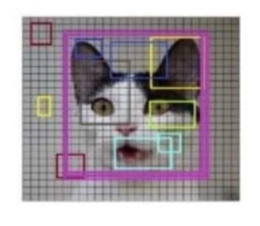

# Smart Glass for Blind People Using Machine Learning

A final-year B.E. project (Information Science & Engineering, Vidyavardhaka
College of Engineering, Mysuru — 2023–24) that prototypes a wearable "smart
glass" system to help visually impaired users understand their surroundings.
A camera feed is passed through a **YOLOv3** object detector trained on the
**MS-COCO** dataset; detected objects and their rough position in the frame
(e.g. *"top left cup"*) are converted to speech using the **Google
Text-to-Speech (gTTS)** API and played back to the user through headphones.

## Team

- Nisha C — 4VV20IS063
- SK Tanushree — 4VV20IS082
- Thanushree MK — 4VV21IS414
- Vidyananda Kashyap A — 4VV20IS108

**Guide:** Prof. Vidyashree KP, Associate Professor, Dept. of ISE, VVCE Mysuru

## How it works

```
User Interface
      │
Real-Time Image Input (webcam)
      │
Object Detection Model (YOLOv3 / Darknet-53, trained on MS-COCO)
      │
Confidence Score > 0.5? ──No──▶ End
      │ Yes
Calculate Distance / Direction (grid position: top/mid/bottom, left/center/right)
      │
Output Result via Text-to-Speech (gTTS)
```

YOLOv3 treats detection as a single regression pass over the image (no
region-proposal stage), which is what makes it fast enough for a real-time,
wearable use case — trading a little accuracy for speed compared to two-stage
detectors.

## Hardware (as prototyped)

| Component | Purpose |
|---|---|
| Webcam | Captures the real-time image ("the eyes" of the glasses) |
| Raspberry Pi 3 (Model B / B+) | Runs the detection + TTS pipeline |
| Wired headphones | Audio output (uses the Pi's built-in audio jack) |
| Push button | Manual trigger to capture a frame |
| MicroSD card (32/64 GB) | OS + storage |
| Breadboard, jumper wires | Prototyping / wiring |
| Glasses frame | Housing for the camera |

## Hardware integration

The software connects to the physical build as follows: a **push button**
wired to a GPIO pin triggers the **webcam** to capture a frame; the frame
runs through YOLOv3 detection; the resulting description is spoken through
**wired headphones** plugged into the Pi's audio jack. See
[`docs/hardware_setup.md`](docs/hardware_setup.md) for wiring diagrams and
setup commands, and `src/raspberry_pi_capture.py` for the button-triggered
capture loop meant to run on the Raspberry Pi itself (as opposed to
`src/detect_and_speak.py`, which works on any machine with a static image).

## Repository structure

```
smart-glass-project/
├── src/
│   ├── detect_and_speak.py         # detection + TTS on a single static image (any machine)
│   └── raspberry_pi_capture.py     # button-triggered live capture loop (runs on the Pi)
├── notebooks/
│   └── smart_glass_pipeline.ipynb  # same pipeline, walked through step-by-step
├── models/
│   ├── yolov3.cfg                  # YOLOv3 network architecture (committed — plain text)
│   ├── coco.names                  # 80 MS-COCO class labels (committed — plain text)
│   └── README.md                   # where to download yolov3.weights (not committed — ~236MB)
├── data/
│   ├── sample.jpg                  # real test image (cup/remote/table) to try detection on
│   └── README.md                   # notes on the sample image + the MS-COCO training dataset
├── images/
│   ├── *.jpg                       # hardware component photos + detection demo figures
│   └── README.md                   # caption/description for each image
├── docs/
│   ├── project_report.pdf          # full project report
│   ├── presentation.pptx           # project presentation slides
│   └── hardware_setup.md           # wiring + Raspberry Pi hardware integration guide
├── .github/workflows/ci.yml        # lint + notebook validity check on push/PR
├── requirements.txt
├── .gitignore
└── README.md
```

> The trained weights file (`yolov3.weights`) is intentionally **not** in
> this repo — see [`models/README.md`](models/README.md) for the download
> link. The architecture (`yolov3.cfg`) and class labels (`coco.names`) are
> committed since they're just text.

## Getting started

1. Clone the repo and install dependencies:

   ```bash
   git clone <your-repo-url>
   cd smart-glass-project
   pip install -r requirements.txt
   ```

2. Download the YOLOv3 model files into `models/` — see
   [`models/README.md`](models/README.md) for direct links.

3. Run detection on an image:

   ```bash
   python src/detect_and_speak.py \
       --image path/to/image.jpg \
       --yolo models/ \
       --confidence 0.5 \
       --threshold 0.3 \
       --output-audio output.mp3
   ```

   This prints the detected objects with their approximate position (e.g.
   `mid center cup, top left remote`) and saves an MP3 with the spoken
   description.

## Software requirements

- Python 3.8+
- `numpy`
- `opencv-python` (≥3.4, for `cv2.dnn`)
- `gTTS`
- `SpeechRecognition`

## Results

On the COCO test-dev benchmark, YOLOv3 achieves **57.9% mAP at 30 FPS**, and
inference on GPU-based devices in this project took roughly **22 ms per
frame** — fast enough for near real-time feedback. See `docs/project_report.pdf`
for the full write-up, literature survey, dataset details, and Darknet-53
architecture breakdown.

Sample output from the trained model (cup, remote, and dining table
correctly detected with confidence scores):



## Future enhancements

- Multi-language text-to-speech output
- Improved detection of small/close objects and door handles
- Location navigation that works reliably in low-light conditions
- Migration from a single-shot image capture to a continuous real-time video
  pipeline on-device

## License

This project is released for academic and educational purposes. Add a
license of your choice (e.g. MIT) before publishing if you intend this to be
reused by others.
